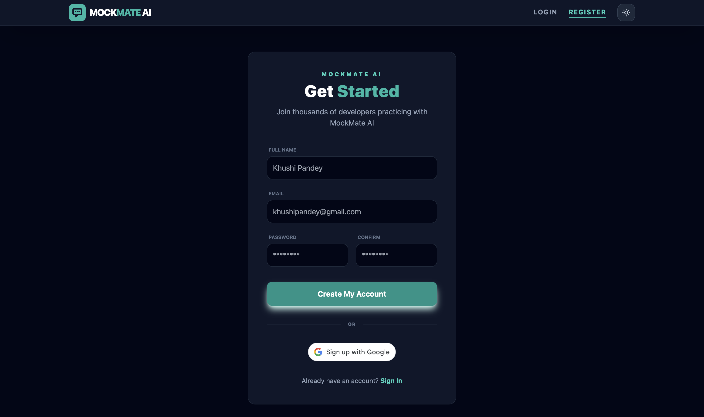
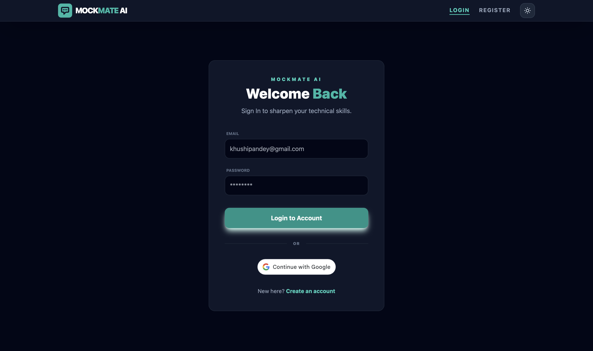
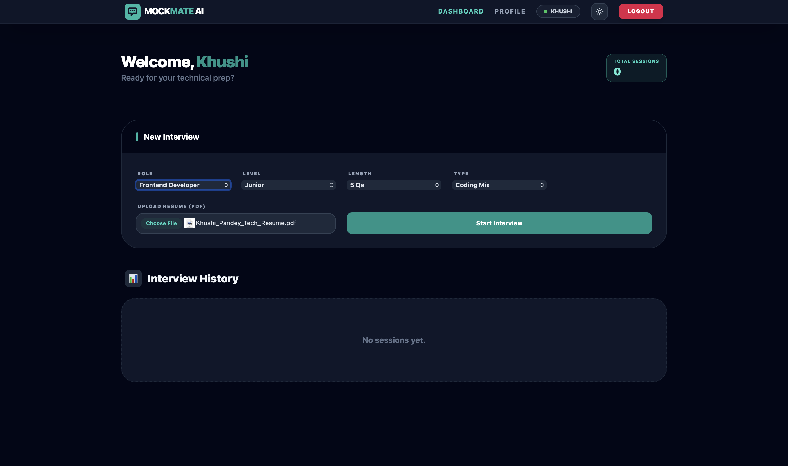
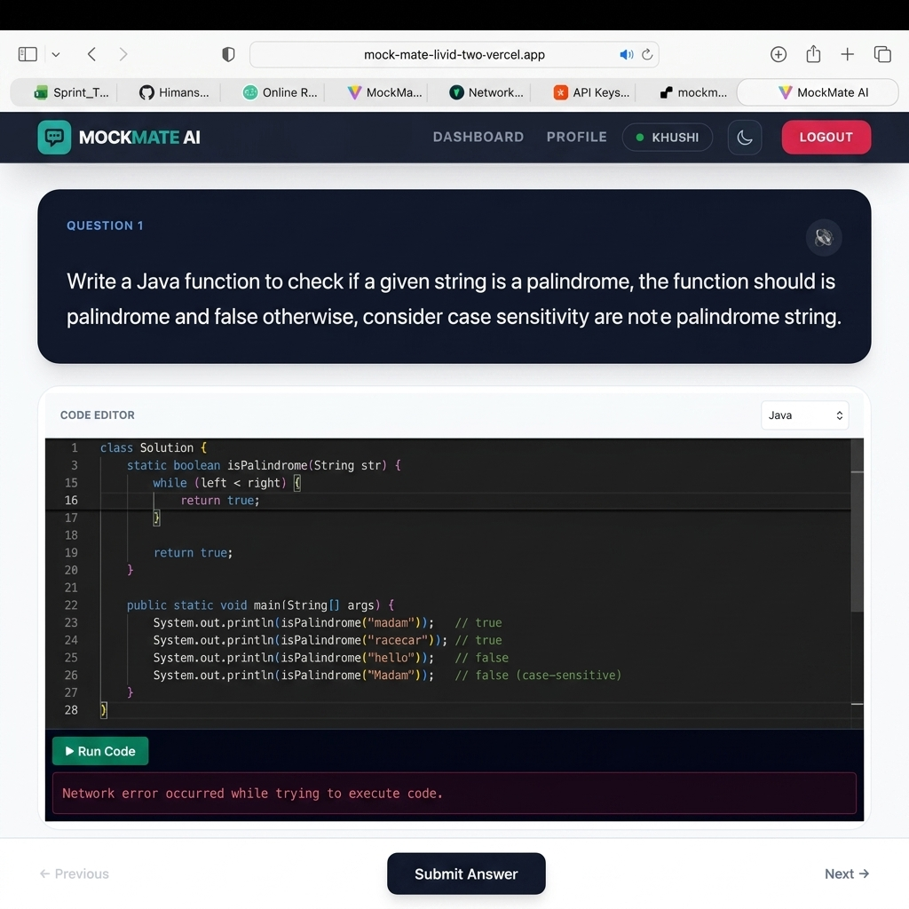
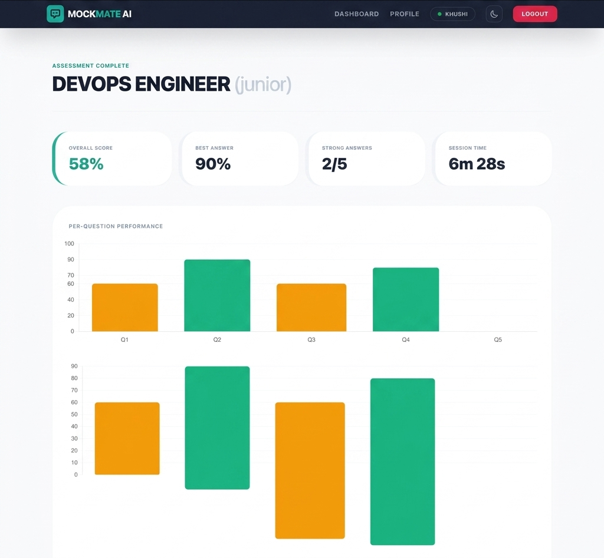

# MockMate AI - Intelligent Technical Interview Simulator

MockMate AI is a full-stack, enterprise-grade application designed to simulate real-world technical interviews. It allows candidates to practice answering both conceptual and coding questions verbally and programmatically, receiving instant, detailed AI-driven evaluation on their performance, technical accuracy, and communication skills.

## Screenshots

### Sign In


### Registration


### Candidate Dashboard


### Setup Interview Options


### Select Level and Role


### Start Interview Session


### Coding Interview Workspace


### Performance Review and Analytics


---

## Key Features

- **Customizable Interviews**: Choose your target role (MERN Stack, Frontend, Backend, DevOps, Data Science, etc.), difficulty level (Junior, Mid-Level, Senior), and interview type (Oral conceptual questions vs. Practical coding challenges).
- **Interactive Speech-to-Text**: Integrates OpenAI Whisper via a cloud-based Python microservice to transcribe voice answers for conceptual questions in real time.
- **Embedded IDE Workspace**: Integrated Monaco Editor (the editor that powers VS Code) supporting multiple languages (Java, JavaScript, Python) with local code execution.
- **Advanced LLM Evaluation**: Leverages Groq API powered by Llama 3.3 (132B / 70B parameter models) to analyze answers and code, outputting technical scores, confidence metrics, constructive feedback, and ideal implementations.
- **Detailed Analytics Dashboard**: View historical session trends, overall score percentages, average technical marks, and interactive graphs tracking your progress across different interview sessions.

---

## Tech Stack

### Frontend
- **Core Library**: React.js (Vite framework preset)
- **State Management**: Redux Toolkit
- **Styling**: Tailwind CSS (Tailored UI styling)
- **Editor Component**: `@monaco-editor/react`
- **Visualization**: Recharts (Interactive Line, Bar, and Radar charts)
- **Routing**: React Router DOM (v6)

### Backend (API Gateway)
- **Runtime**: Node.js
- **Framework**: Express.js
- **Database**: MongoDB (Mongoose ODM)
- **Authentication**: JSON Web Tokens (JWT) and bcryptjs
- **CORS Management**: Dynamically configured for secure multi-origin access.

### AI Microservice
- **Runtime**: Python 3.9+
- **Framework**: FastAPI (high-performance web routing)
- **Speech-to-Text**: OpenAI Whisper engine
- **Audio Processing**: PyDub and FFMPEG libraries
- **LLM Integrations**: Groq Cloud Engine (or local Ollama fallbacks)

---

## Getting Started

### Prerequisites

1. **Node.js** (v16+) and **npm**.
2. **Python** (v3.9+) and **pip**.
3. **MongoDB**: A running local MongoDB instance or a MongoDB Atlas Connection string.
4. **FFmpeg**: Installed and configured in your system's environment PATH (required for transcribing verbal responses).

### 1. Clone the Repository

```bash
git clone https://github.com/YOUR_GITHUB_USERNAME/MockMate.git
cd MockMate
```

### 2. Backend Setup (Node.js)

```bash
cd backend
npm install

# Create a .env file with the following keys:
# PORT=5001
# MONGO_URI=your_mongodb_connection_string
# JWT_SECRET=your_jwt_secret
# GOOGLE_CLIENT_ID=your_google_auth_client_id

# Run the server in development mode
npm run dev
```

### 3. AI Service Setup (Python)

```bash
cd ../ai-service

# Create and activate virtual environment
python -m venv venv
source venv/bin/activate  # On Windows use: venv\Scripts\activate

# Install dependencies
pip install -r requirements.txt

# Create a .env file with the following keys:
# AI_SERVICE_PORT=8000
# GROQ_API_KEY=your_groq_api_key
# GROQ_MODEL_NAME=llama-3.3-70b-versatile

# Run the microservice
uvicorn main:app --reload --port 8000
```

### 4. Frontend Setup (React)

```bash
cd ../frontend
npm install

# Create a .env file with the following keys:
# VITE_API_URL=http://localhost:5001/api
# VITE_GOOGLE_CLIENT_ID=your_google_auth_client_id

# Run the frontend development server
npm run dev
```

---

## Architecture Overview

The application follows a decoupled microservice-inspired architecture designed to separate resource-intensive AI operations from standard user management:

1. **Client (React)**: Captures user input (speech logs, written code, selections), renders Monaco Editor and dashboard graphs, and sends payloads to the Backend.
2. **Node.js Gateway**: Manages authentication, session tracking, database storage, and forwards raw text/audio payloads to the Python AI service.
3. **Python AI Service**: Handles audio transcription using Whisper, validates code requests, formats LLM prompts, and communicates with Groq Cloud LLM for real-time evaluations.
